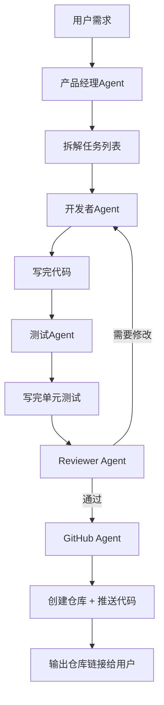

# 第三阶段 第6周：多智能体代码生成助手 - 第二个简历项目

> 本周目标：完成第二个高质量项目：**多智能体代码生成助手**，用户说需求，AI自动写完代码提交GitHub。这个项目非常吸睛，面试官肯定会问。
> 
> 项目亮点：全流程自动化，从需求 → 可运行代码，多Agent协作评审，质量更高。

| 天 | 内容 | 时长 | 完成打卡 |
|----|------|------|----------|
| 第1天 | 需求分析 + 架构设计 | 4h | ☐ |
| 第2天 | 框架选型 + 项目脚手架 | 4h | ☐ |
| 第3天 | 需求规划Agent开发 | 4h | ☐ |
| 第4天 | 代码编写Agent + 单元测试Agent | 4h | ☐ |
| 第5天 | Code Review + 修正循环 | 4h | ☐ |
| 第6天 | GitHub API对接，自动创建仓库推送 | 4h | ☐ |
| 第7天 | 异常处理 + 重试机制 + 稳定性优化 | 4h | ☐ |
| 第8天 | Streamlit前端开发 | 4h | ☐ |
| 第9天 | 全流程测试 + Bug修复 | 4h | ☐ |
| 第10天 | 项目整理 + README + 提交GitHub | 4h | ☐ |
| 第11天 | 第三阶段总结沉淀 | 4h | ☐ |
| 第12天 | 休息调整 | 4h | ☐ |

---

## 🎯 第1天：需求分析和架构设计

### 全天（4h）：需求和流程设计

### 项目需求

> 用户输入一段自然语言需求描述，比如：
> > "帮我写一个Python待办清单命令行程序，支持添加、删除、查看、保存到文件"
> 
> 多Agent自动协作，完成：
> 1. 需求理解拆解 → 2. 任务拆分 → 3. 编写代码 → 4. 写单元测试 → 5. Code Review → 6. 修正问题 → 7. 自动创建GitHub仓库并推送代码
> 
> 最后用户直接得到一个GitHub仓库链接，里面是完整可运行的项目。

### 为什么用多Agent做这个？

- **分工专业**：PM写需求，开发写代码，测试写测试，Review审代码，每个Agent专精
- **自我修正**：Review发现问题，开发者再改，比单个Agent写一遍质量高
- **循环改进**：不好就一直改，直到通过

### 角色定义（五个Agent协作）

| Agent角色 | 核心职责 |
|-----------|----------|
| **产品经理Agent** | 理解用户模糊需求，拆解成清晰可执行的开发任务列表，输出结构化任务 |
| **开发者Agent** | 根据任务写代码，符合PEP8，加注释，保证可运行 |
| **测试Agent** | 给每个函数写单元测试，覆盖主要场景 |
| **Reviewer Agent** | 检查代码质量：功能完整吗？有bug吗？风格对吗？提修改意见 |
| **GitHub Agent** | 自动创建仓库，推送代码，返回链接给用户 |

### 完整协作流程图



### 技术选型

- **编排框架**：LangGraph（需要循环判断，LangGraph灵活）
- **代码解析**：用PyGithub操作GitHub API
- **前端**：Streamlit（简单快速）

---

## 🏗️ 第2天：框架选型和项目脚手架

### 全天（4h）：搭建基础

**为什么选LangGraph？**
- 需要条件判断："Review通过就去GitHub，不通过回去改"
- 需要循环：改了再评，评了再改
- LangGraph原生支持循环和条件分支，比CrewAI更灵活适合这个场景

**项目目录结构设计：**

```
multi-agent-code-generator/
├── .env.example
├── .gitignore
├── README.md
├── requirements.txt
├── app.py              # Streamlit前端入口
├── agents/
│   ├── __init__.py
│   ├── product_manager.py   # 产品经理Agent
│   ├── developer.py         # 开发者Agent
│   ├── tester.py            # 测试Agent
│   ├── reviewer.py          # Reviewer Agent
│   └── github_agent.py      # GitHub操作Agent
├── graph/
│   ├── __init__.py
│   └── codegen_graph.py     # LangGraph图定义
└── utils/
    ├── __init__.py
    ├── github.py            # GitHub API封装
    └── parser.py            # LLM输出解析工具
```

**安装核心依赖：**
```bash
pip install langgraph pygithub streamlit python-dotenv
```

**创建`.env`文件：**
```
OPENAI_API_KEY=your-key-here
GITHUB_TOKEN=your-github-token-here
```

**说明：**
- GitHub Token：在GitHub Settings → Developer settings → Personal access tokens → 生成，勾`repo`权限就够了

---

## 📋 第3天：开发需求规划Agent

### 全天（4h）：实现需求拆解

**核心任务：** 用户给一句话模糊需求，Agent拆解成清晰的有序任务列表。

**Prompt设计参考：**

```python
SYSTEM_PROMPT = """
你是一个经验丰富的产品经理，擅长把用户模糊的需求拆解成清晰可执行的开发任务。

用户需求: {user_requirement}

请你按照以下要求输出JSON格式：

{{
  "title": "项目名称",
  "description": "项目一句话介绍",
  "tasks": [
    {{
      "id": 1,
      "name": "任务名称",
      "description": "任务详细描述，告诉开发者要做什么",
      "files": ["文件名1", "文件名2"]
    }},
    ...
  ]
}}

要求：
1. 任务要按开发顺序排列，先基础结构后功能
2. 每个任务只做一件事
3. 明确说明每个任务生成哪些文件
4. 不要漏了README.md
"""
```

**解析输出：**
- LLM输出JSON，你解析成Python对象
- 如果JSON格式错了，重试一次（异常处理后面第七天做）

**测试用例：**

测试这个需求，看拆解合不合理：
```
"帮我写一个Python命令行待办清单程序，支持添加、删除、查看任务，数据保存到JSON文件"
```

你觉得拆解出来的任务顺序对吗？文件拆分合理吗？不合理就优化Prompt。

---

## 👨‍💻 第4天：代码编写 + 单元测试 Agent

### 全天（4h）：两个Agent开发

### 1. 开发者Agent

**核心Prompt：**
```
你是资深Python开发者，现在需要完成任务：

任务信息：{task}

项目整体需求：{requirement}

已有的文件结构：{file_tree}

请你按照要求输出完整代码：
- 文件名：{{filename}}
- 完整代码：{{code}}

要求：
1. 代码符合PEP8风格，变量命名清晰
2. 添加必要注释
3. 处理基本异常
4. 不要省略代码，输出完整可运行的代码
```

**输出解析：** LM输出```python ... ```，提取出来写到文件。

### 2. 测试Agent

**核心Prompt：**
```
你是测试工程师，现在需要给这个项目写单元测试：

项目代码文件：{file_list}

请给每个功能写单元测试，使用pytest框架。
要求：
- 覆盖主要正常场景和异常场景
- 测试用命名清晰
- 输出完整可运行的测试代码
```

**你的任务：**
- 实现开发者Agent，能根据任务写代码写到对应文件
- 实现测试Agent，能写pytest单元测试
- 测试：跑一个简单任务，看代码写得对不对

---

## 🔍 第5天：Code Review + 修正循环

### 全天（4h）：实现评审循环

### Reviewer Agent做什么？

拿到代码，检查四个方面：

1. **功能完整性**：是不是满足了需求？所有任务都完成了吗？
2. **代码质量**：有没有明显bug？逻辑对吗？
3. **编码风格**：命名对吗？有注释吗？
4. **可运行**：依赖对吗？入口清晰吗？

**Prompt模板：**

```
你是高级工程师，负责Code Review。

项目需求：{requirement}
所有代码文件：{file_list}

请你逐文件检查，给出评审意见：

输出JSON格式：
{{
  "passed": true/false,
  "issues": [
    {{
      "file": "文件名",
      "description": "问题描述",
      "suggestion": "改进建议"
    }}
  ],
  "summary": "整体评价"
}}

如果没有问题，passed = true，issues为空。
如果有问题，passed = false，列出所有问题。
```

### 修正循环逻辑

在LangGraph里这么处理：

```python
def should_continue(state):
    review_result = state["review_result"]
    if review_result["passed"]:
        return "passed"
    else:
        return "fix"
```

- 如果`passed = false` → 回到开发者Agent，带着Review意见修正
- 如果`passed = true` → 进入下一步GitHub推送

**你的任务：**
- 实现Reviewer Agent
- 在LangGraph里配置条件边
- 测试：故意写一个有问题的代码，看Reviewer能不能找出来，然后修正

---

## 🐙 第6天：对接GitHub API，自动推送

### 全天（4h）：实现GitHub自动创建

**什么是PyGithub？**
- Python操作GitHub API的库
- 支持创建仓库、添加文件、推送代码

**安装：**
```bash
pip install PyGithub
```

**最小示例：创建仓库并提交文件**

```python
from github import Github
import os

g = Github(os.getenv("GITHUB_TOKEN"))
user = g.get_user()

# 创建仓库
repo = user.create_repo(
    "demo-project",
    description="Automatically generated by Multi-Agent Code Generator",
    private=False
)

# 创建文件
repo.create_file(
    "README.md",
    "initial commit",
    "# Demo Project\n\nThis project generated by AI."
)

print(f"Repo created: {repo.html_url}")
```

**你的任务：**
1. 封装`GitHubHelper`类
   - `create_repo(project_name, description)` → 返回repo对象
   - `commit_file(repo, path, content, message)`
2. 项目生成完后，遍历本地所有文件，逐个提交到GitHub
3. 测试：跑完整流程，去GitHub看代码是不是都提交了

---

## 🛡️ 第7天：异常处理和稳定性优化

### 全天（4h）：让Agent更稳定

**Agent开发最常见问题：**

### 1. LLM输出JSON格式错误

**解决：增加重试机制**

```python
def parse_json_output(output, max_retries=3):
    for i in range(max_retries):
        try:
            # 提取JSON部分（有时候LLM会有多余文字）
            json_str = extract_json(output)
            return json.loads(json_str)
        except:
            # 解析失败，让LLM重新输出
            output = llm(f"你输出的JSON格式不对，请重新输出，只输出合法JSON。")
    return None
```

### 2. LLM输出代码格式不对，找不到代码块

**解决：**
- 用正则提取```python ... ```块
- 如果提取失败，重试一次

### 3. 死循环：一直改不通过

**解决：**
- 设置最大重试次数（比如最多3轮修改）
- 超过次数直接强制通过，告诉用户有一些问题可能没解决

### 4. GitHub API调用失败

**解决：**
- 捕获异常，返回清晰错误信息给用户
- 检查Token对不对，权限对不对

**你的任务：**
- 给每个解析环节加上重试
- 加上最大循环次数限制
- 处理常见API异常，给用户友好提示

---

## 🖥️ 第8天：Streamlit前端开发

### 全天（4h）：做用户界面

**功能设计：**

1. **输入区**
   - 文本框：用户输入需求
   - 项目名称输入（默认从需求生成）
   - 复选框：是否设为私有仓库

2. **运行进度展示**
   - 分步显示当前走到哪一步：
     - ✅ 需求拆解完成
     - ✅ 代码编写完成
     - ✅ 测试编写完成
     - 🔄 Code Review中...
   - 用户能看到进度

3. **结果输出**
   - 生成完成后，显示GitHub仓库链接
   - 可以下载源码zip

**简化代码框架：**

```python
import streamlit as st
from graph.codegen_graph import run_codegen

st.set_page_config(page_title="Multi-Agent 代码生成助手", layout="wide")
st.title("🤖 Multi-Agent 代码生成助手")

requirement = st.text_area("输入你的需求", height=150, 
    placeholder="比如：帮我写一个Python命令行待办清单程序，支持添加、删除、查看，保存到JSON文件...")

project_name = st.text_input("项目名称（自动生成可留空）")

if st.button("开始生成"):
    if not requirement:
        st.error("请输入需求")
        st.stop()
    
    with st.spinner("产品经理拆解需求中..."):
        # 调用LangGraph运行
        # 分步更新进度
        result = run_codegen(requirement, project_name)
    
    if result["success"]:
        st.success("生成完成！")
        st.markdown(f"👉 [查看GitHub仓库]({result['repo_url']})")
    else:
        st.error(f"生成失败: {result['error']}")
```

**你的任务：**
- 实现前端界面
- 进度展示让用户知道现在在哪一步
- 测试全流程交互

---

## 🧪 第9天：全流程测试和Bug修复

### 全天（4h）：测试三个完整例子

必须至少跑通三个例子，验证全流程正常：

**测试用例1：简单Python脚本**
```
需求：写一个Python脚本，从CSV文件读取数据，计算平均值和标准差，输出结果。
```

**测试用例2：小Web应用**
```
需求：用Flask写一个简单的个人留言板，支持添加留言，查看留言，数据存在SQLite。
```

**测试用例3：命令行工具**
```
需求：写一个命令行URL缩短器，用Python和Click，数据存在JSON文件，支持缩短和查询。
```

**测试要点：**
1. 需求拆解对不对？
2. 代码能正常运行吗？
3. 单元测试能跑通吗？
4. Review能找出问题吗？
5. GitHub能正常创建推送吗？

**记录遇到的每个bug，逐个修复。**

---

## 📝 第10天：项目整理提交GitHub

### 全天（4h）：整理成专业项目

**README必须包含：**

1. **项目介绍**：这个项目做什么的，有什么特点
2. **架构图**：放我们之前画的多Agent协作流程图（mermaid格式，GitHub直接显示）
3. **功能特点**：用bullet point列出来
   - ✅ 多智能体分工协作，PM/开发/测试/Review各司其职
   - ✅ 循环评审修正，代码质量更高
   - ✅ 自动创建GitHub仓库并推送代码
   - ✅ Streamlit简洁Web界面
4. **快速开始**：一步步说明怎么安装、配置、运行
5. **效果展示**：放一张界面截图，放一个生成好的示例项目链接
6. **依赖**：说明需要OpenAI API Key和GitHub Token

**项目截图：** 截一张你的运行界面放到README，更生动。

**推送到GitHub：**
```bash
git add .
git commit -m "initial commit: complete multi-agent code generator"
git push origin main
```

---

## 📌 第11天：第三阶段总结沉淀

### 全天（4h）：总结两个项目

第三阶段（5-6周）你已经完成了**两个完整可写进简历的项目**：

1. **个人财经助手Agent**（CrewAI 多Agent）
   - 多角色分工流水线协作
   - 集成金融数据API和搜索
   - 用户偏好记忆

2. **多智能体代码生成助手**（LangGraph 循环评审）
   - 需求 → 代码全流程自动化
   - 循环评审修正，提高质量
   - 自动推送GitHub

**整理笔记思考：**

- CrewAI和LangGraph各自适合什么场景？
- 你更喜欢用哪个？为什么？
- 多Agent协作最大的好处是什么？最大的问题是什么？
- 这两个项目，你觉得哪个更能体现你的能力？

**更新你的GitHub个人主页，把这两个项目放上去。**

---

## ✅ 项目完成验收标准

- [ ] 全流程能跑通：用户输入需求 → 输出GitHub链接
- [ ] 五个Agent协作正确：PM → 开发 → 测试 → Review → GitHub
- [ ] 支持循环修正：Review不通过回去改
- [ ] 异常处理：格式错了重试，有最大循环限制
- [ ] Streamlit界面可用，进度展示清晰
- [ ] GitHub上有完整代码和README
- [ ] README有架构图和使用说明，有截图

---

## 📚 扩展阅读（选看）

- [LangGraph官方文档](https://langchain-ai.github.io/langgraph/)
- [PyGithub文档](https://pygithub.readthedocs.io/)
- [Devin - 第一个AI软件工程师](https://www.cognition.ai/devin) -  inspiration
- [OpenDevin开源项目](https://github.com/OpenDevin/OpenDevin) - 参考思路
