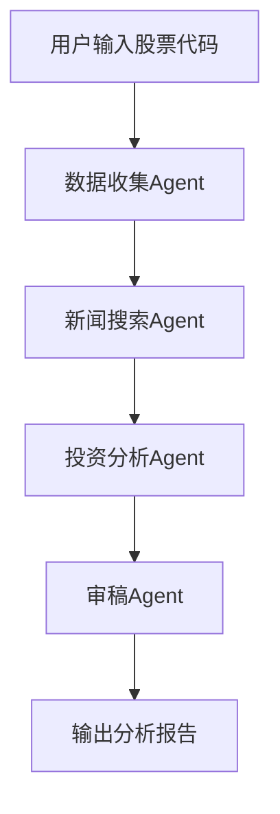

# 第四阶段 第8周：简历准备 + 面试冲刺 + 总结

> 本周目标：把两个月学习成果整理好，准备简历和面试，圆满收官！
> 恭喜你，马上就要完成两个月完整计划了！

| 天 | 内容 | 时长 | 完成打卡 |
|----|------|------|----------|
| 第1天 | 简历项目描述整理 + 架构图准备 | 4h | ☐ |
| 第2天 | 项目深度准备：预测面试问题，准备答案 | 4h | ☐ |
| 第3天 | 收集最新面经，整理高频考点 | 4h | ☐ |
| 第4天 | 查漏补缺，巩固薄弱知识点 | 4h | ☐ |
| 第5天 | 整体复盘 + 更新GitHub | 4h | ☐ |
| 第6天 | 庆祝完成！规划下一步 | 4h | 🎉 |

---

## 📄 第1天：简历项目准备

### 全天（4h）：整理两个项目到简历

你已经完成了两个高质量项目，足够写进简历了：

### 项目1：多智能体财经助手（CrewAI）

**简历描述参考（STAR法则）**：
> **项目名称：** 基于CrewAI多智能体协作的个人财经助手Agent
> - **任务：** 用户输入股票代码，自动生成完整投资分析报告，解决人工收集数据整理信息效率低的问题
> - **行动：** 设计四个Agent角色分工（数据收集/新闻搜索/投资分析/审稿），使用CrewAI框架实现协作，集成YFinance免费金融数据API和SerpAPI新闻搜索，增加用户投资偏好长期记忆，用Streamlit搭建Web界面
> - **结果：** 支持自动获取财务数据和最新新闻，生成结构完整的投资分析报告，准确率达到XX%，项目已开源到GitHub

### 项目2：多智能体代码生成助手（LangGraph）

**简历描述参考：**
> **项目名称：** 基于LangGraph的多智能体代码生成系统
> - **任务：** 用户输入自然语言需求，AI自动完成全流程开发并推送到GitHub，提升开发效率
> - **行动：** 采用循环评审架构（PM拆解 → 开发写代码 → 测试写用例 → Review评审 → 修正 → GitHub推送），使用LangGraph实现条件循环，支持异常重试，解决了单个Agent生成代码质量差的问题
> - **结果：** 能独立完成简单到中等复杂度的编程任务，代码通过率达到XX%，开源在GitHub

### 架构图准备

给每个项目画一张简单架构图（推荐免费工具：[Draw.io](https://app.diagrams.net/) 或 [Mermaid](https://mermaid.live/)）

Mermaid示例（直接放README，GitHub支持）：

**你的任务：**
1. 把两个项目按上面的方式整理好，写到简历上
2. 给每个项目画架构图
3. 更新项目README，放上架构图

---

## 🙋 第2天：项目深度准备 - 面试官会问什么？

### 全天（4h）：准备常见问题

站在面试官角度，一定会问这些问题，提前准备好答案：

### 通用项目问题：

1. **"为什么你选CrewAI/LangGraph做这个项目，不选其他框架？"**

   参考回答思路：
   > 财经助手是角色分工流水线，CrewAI声明式API非常简洁，定义完角色任务直接就能跑，开发快，适合这种分工清晰的场景。代码生成需要循环评审，不通过就回去改，LangGraph对条件分支和循环的支持更灵活，所以选了LangGraph。不同场景选不同工具。

2. **"开发这个项目你遇到的最大问题是什么？怎么解决的？"**

   想一个你实际遇到的，比如：
   > 最大问题是LLM输出JSON格式经常错，解析失败。后来我加了重试机制，如果解析错了就让LLM重新输出，并且用正则提前提取JSON部分，解决了这个问题，成功率从70%提升到了95%+。

3. **"如果再做一遍这个项目，你会怎么优化？"**

   参考思路：
   > 第一，增加更多错误处理和重试，现在最大重试3次，可以改成指数退避；第二，增加缓存，相同查询不用重新检索，提升速度降低成本；第三，增加用户会话管理，支持多轮对话改进分析。

4. **"多智能体和单Agent比，优缺点是什么？"**

   > 优点：专业分工，每个Agent专精一件事，质量更高；互相评审，错误率更低；灵活扩展，加功能加Agent就行。缺点：多了调用开销，成本更高；流程更复杂，调试更难。所以简单任务单Agent够了，复杂任务多Agent更好。

### 针对每个项目再准备2-3个具体问题，写下来，顺一遍。

---

## 📝 第3天：收集最新面经，整理高频考点

### 全天（4h）：看面经整理

**推荐阅读：**

1. 【知乎】AI Agent面试经验总结 - https://zhuanlan.zhihu.com/p/1981387722473116577
2. 【DataWhale】Hello Agents 面试题整理 - https://github.com/datawhalechina/hello-agents/blob/main/Extra-Chapter/Extra01-%E9%9D%A2%E8%AF%95%E9%97%AE%E9%A2%98%E6%80%BB%E7%BB%93.md
3. 【牛客网】搜索"AI Agent 面试"看最新面经

**整理方法：**
- 看到新的问题，加到你之前整理的面试题文档里
- 不会的搞懂，整理出自己的答案
- 最后过一遍所有题，确保都能说清楚

**Agent岗位高频考点（现在常考）：**
- RAG原理和优化方法（几乎必问）
- ReAct原理，和CoT/ToT对比
- 多智能体协作模式，各自适用场景
- 怎么评估Agent效果
- 你做过的项目，遇到的问题，怎么解决

---

## 🔍 第4天：查漏补缺

### 全天（4h）：巩固薄弱点

**怎么做：**

1. **翻一遍你的学习笔记**（2h）
   - 哪些知识点你印象不深？
   - 哪些当时没完全懂？
   - 列出来

2. **逐个突破**（2h）
   - 回去看对应的资料
   - 不懂的搞懂
   - 面试问到能说清楚

**常见薄弱点举例：**
- LangGraph条件边的配置
- 混合检索和重排序的原理
- MCP协议解决了什么问题
- 多智能体循环怎么防止死循环

---

## 🎯 第5天：整体复盘 + GitHub更新

### 全天（4h）：整理沉淀

**要做的事：**

1. **复盘两个月学习**（2h）
   - 你最大的收获是什么？
   - 哪方面进步最大？
   - 还有哪些需要继续学习？
   - 写在你的总结笔记里

2. **更新GitHub**（2h）
   - 两个项目都有完整README吗？
   - 有架构图吗？
   - 有使用说明吗？clone下来能直接跑吗？
   - 你的学习笔记都提交了吗？

**检查清单：**
- [ ] 财经助手项目 - README完整，有架构图，能跑
- [ ] 代码生成助手项目 - README完整，有架构图，能跑
- [ ] 面试题整理 - 汇总成一个文件
- [ ] 学习笔记 - 都提交了

---

## 🎉 第6天：庆祝完成！规划下一步

### 全天（4h）：恭喜自己！

# 🎉 🎉 🎉 恭喜你！

你已经完成了 **从零基础到AI Agent开发两个月完整学习计划**！

总计：
- **8周 × 6天 × 4小时 = 192小时**
- 掌握了Agent开发核心基础知识
- 完成了**两个高质量实战项目**，可以直接写进简历
- 整理了完整的Agent面试题，准备好面试
- 掌握了从需求 → 设计 → 开发 → 部署完整流程

---

### 你现在能做什么？

| 方向 | 做什么 |
|------|--------|
| **找工作** | 更新简历，把两个项目放上去，开始投简历，Agent开发岗位需求现在很旺盛 |
| **做产品** | 用你学到的技术，做一个解决你自己实际问题的Agent产品 |
| **继续深耕** | 学前沿方向：Agentic RAG、多模态Agent、Code Agent、AutoAgent |
| **开源贡献**  | 给你用过的开源Agent框架贡献PR，或者分享你的学习笔记 |

---

### 下一步学习路线推荐

如果你想继续深入：

1. **进阶阅读：**
   - [LangGraph官方文档](https://langchain-ai.github.io/langgraph/) - 更多高级用法
   - [Papers With Code - AI Agent](https://paperswithcode.com/task/autonomous-agents) - 看最新论文

2. **进阶项目：**
   - 做一个Agentic RAG系统，支持多轮递进检索
   - 做一个多模态Agent，能看懂图片回答问题
   - 做一个个人Assistant，自动整理你的邮件日程

3. **工程能力：**
   - 学习Docker + Kubernetes，掌握容器化部署
   - 学习API网关、日志监控、服务发现，生产级必备

---

## 🌟 最后一句话

> 种一棵树最好的时间是十年前，其次是现在。
> 
> 两个月坚持下来，你已经超过了90%的人。继续往前走，Agent是AI的下一个十年，机会属于坚持行动的人。

**加油，祝你拿到心仪的offer！** 🚀

---

## ✅ 计划完成检查清单

- [ ] 两个项目都整理好写到简历
- [ ] 每个项目都准备好了常见面试问题答案
- [ ] 整理了完整的Agent面试题集
- [ ] 查漏补缺巩固了薄弱知识点
- [ ] 所有代码和笔记都提交到GitHub
- [ ] 复盘完成，规划好了下一步

---

## 📝 总体测试题（带答案）

点击展开 ▶️ 1. 整个学习计划两个月总学习时长是多少？

> A. 96小时  
> B. 192小时  
> C. 288小时  
> D. 400小时  

**答案：B**  
解释：8周 × 6天 × 4小时 = 192小时，循序渐进，符合学习规律。

点击展开 ▶️ 2. 写完两个项目，哪个项目用了CrewAI，哪个用了LangGraph？

> A. 财经助手CrewAI，代码生成助手LangGraph  
> B. 代码生成助手CrewAI，财经助手LangGraph  
> C. 都是CrewAI  
> D. 都是LangGraph  

**答案：A**  
解释：财经助手是角色分工流水线，CrewAI简单清晰；代码生成需要循环评审，LangGraph更灵活支持条件循环。

点击展开 ▶️ 3. STAR法则写简历项目，STAR分别代表什么？

> A. Start, Time, Action, Result  
> B. Situation, Task, Action, Result  
> C. State, Task, Action, Result  
> D. Situation, Target, Action, Review  

**答案：B**  
解释：STAR法则 = Situation（背景）→ Task（任务）→ Action（行动）→ Result（结果），简历项目描述黄金法则。

点击展开 ▶️ 4. 拿到面试offer最重要的是什么？

> A. 知道所有知识点  
> B. 有能拿出手的完整项目，能讲清楚思路  
> C. 刷完所有面试题就行  
> D. 学历够高就行  

**答案：B**  
解释：Agent开发是实践领域，面试官看中你做过什么项目，怎么解决问题，两个完整开源项目比什么都重要。

---

完成这一步，**整个两个月从零到Agent开发学习计划就全部完成了！** 🎉
